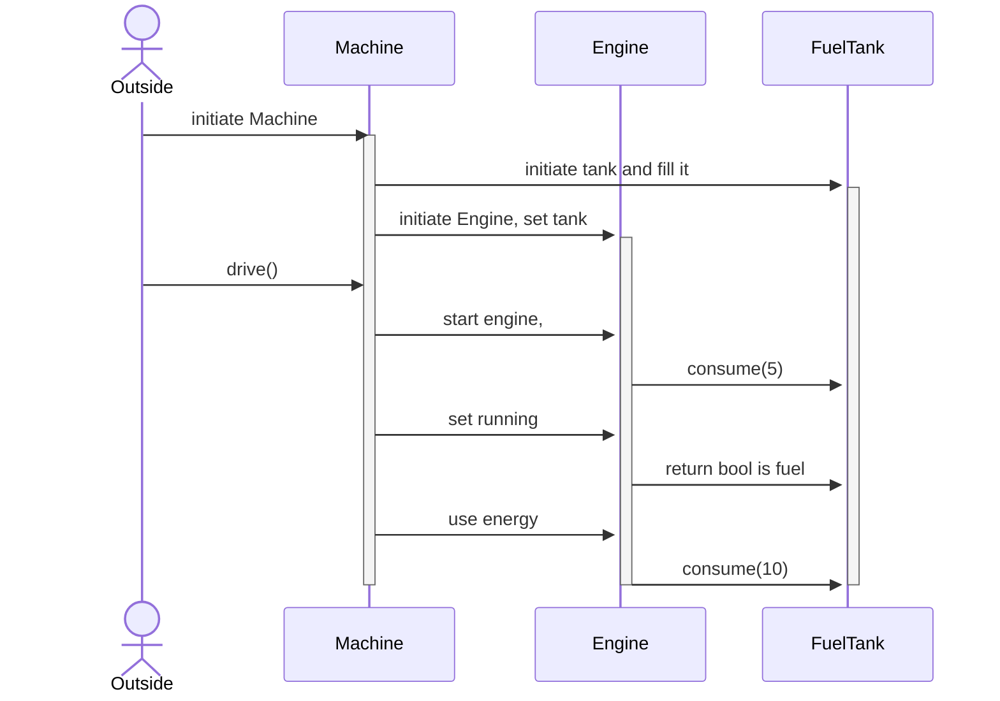

```mermaid
sequenceDiagram 
  actor Outside
  participant Machine
  participant Engine
  participant FuelTank
  Outside->>Machine: initiate Machine
  activate Machine
  Machine->>+FuelTank: initiate tank and fill it
  activate FuelTank
  Machine->>+Engine: initiate Engine, set tank
  activate Engine
  Outside->>Machine: drive()
  Machine->>Engine: start engine, 
  Engine->>FuelTank: consume(5)
  Machine->>Engine: set running
  Engine->>FuelTank: return bool is fuel
  Machine->>Engine: use energy
  Engine->>FuelTank: consume(10)
  deactivate FuelTank
  deactivate Engine
  deactivate Machine
```
