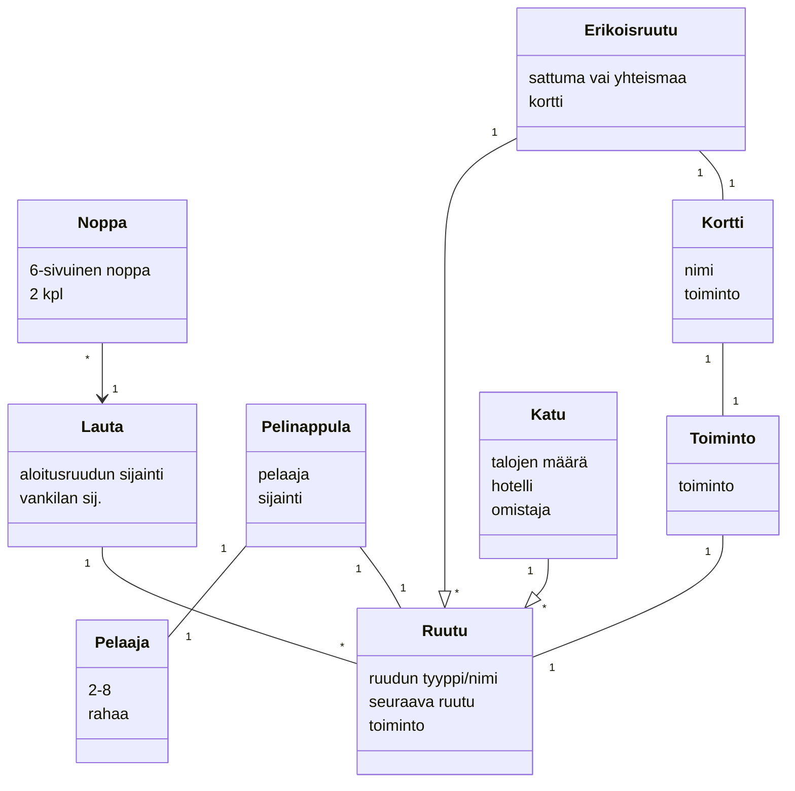

```mermaid
classDiagram
flowchart
  Noppa "*" --> "1" Lauta
  Lauta "1" -- "*" Ruutu
  Pelinappula "1" -- "1" Ruutu
  Pelinappula "1" -- "1" Pelaaja
  Toiminto "1" -- "1" Ruutu
  Kortti "1" -- "1" Toiminto
  Erikoisruutu "1" -- "1" Kortti
  Erikoisruutu "1" --|> "*" Ruutu
  Katu "1" --|> "*" Ruutu
  class Noppa{
    6-sivuinen noppa
    2 kpl
  }
  class Lauta{
    aloitusruudun sijainti
    vankilan sij.
   }
  class Pelaaja{
    2-8
    rahaa
  }
  class Ruutu{
    ruudun tyyppi/nimi
    seuraava ruutu
    toiminto
  }
  class Erikoisruutu{
    sattuma vai yhteismaa
    kortti
  }
  class Katu{
    talojen määrä
    hotelli
    omistaja
  }
  class Pelinappula{
    pelaaja
    sijainti
  }
  class Toiminto{
    toiminto
   }
  class Kortti{
    nimi
    toiminto
   }
```
