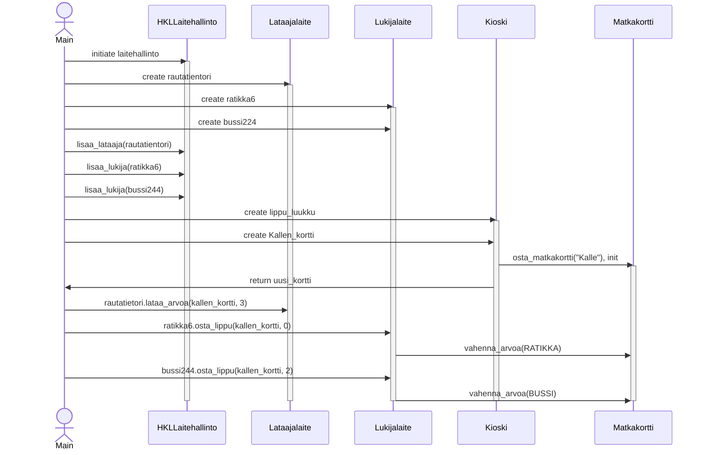

```mermaid
sequenceDiagram
  actor Main
  participant H as HKLLaitehallinto
  participant La as Lataajalaite
  participant Lu as Lukijalaite
  participant K as Kioski
  participant M as Matkakortti
  Main->>H: initiate laitehallinto
  activate H
  Main->>La: create rautatientori
  activate La
  Main->>Lu: create ratikka6
  activate Lu
  Main->>Lu: create bussi224
  Main->>H: lisaa_lataaja(rautatientori)
  Main->>H:lisaa_lukija(ratikka6)
  Main->>H:lisaa_lukija(bussi244)
  Main->>K: create lippu_luukku
  activate K
  Main->>K: create Kallen_kortti
  K->>M: osta_matkakortti("Kalle"), init
  activate M
  K->>Main: return uusi_kortti
  Main->>La: rautatietori.lataa_arvoa(kallen_kortti, 3)
  Main->>Lu: ratikka6.osta_lippu(kallen_kortti, 0)
  Lu->>M: vahenna_arvoa(RATIKKA)
  Main->>Lu: bussi244.osta_lippu(kallen_kortti, 2)
  Lu->>M: vahenna_arvoa(BUSSI)
  deactivate H
  deactivate La
  deactivate Lu
  deactivate K
  deactivate M
  

  
```
